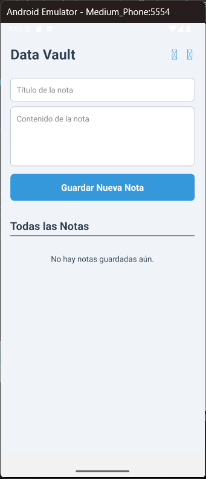

# 🔐 DataVault

> **Tu información segura, siempre.**

DataVault es una aplicación móvil desarrollada en **React Native** diseñada para almacenar notas y datos sensibles de forma local y segura. Cuenta con una interfaz moderna que se adapta automáticamente al tema de tu dispositivo (Modo Claro / Modo Oscuro).

## 📱 Galería

| Modo Claro ☀️ | Modo Oscuro 🌙 |
|:---:|:---:|
|  |  |

## 🚀 Características
- **Persistencia de Datos:** Almacenamiento local seguro (sin depender de la nube).
- **Diseño Adaptativo:** Interfaz UI/UX optimizada que detecta el tema del sistema.
- **Gestión CRUD:** Crear, leer, editar y eliminar notas fácilmente.
- **Performance Nativo:** Optimizada para Android con Gradle 8.11 y Java 21.

## 🛠️ Tecnologías


## 📦 Instalación
Si deseas probar este proyecto:

1. Clonar el repositorio:
   ```bash
   git clone [https://github.com/Miguel290419/DataVault-App.git](https://github.com/Miguel290419/DataVault-App.git)
2. Instalar dependencias:
   ```bash
   npm install
3. Ejecutar en Android:
   ```bash
   npm run android
